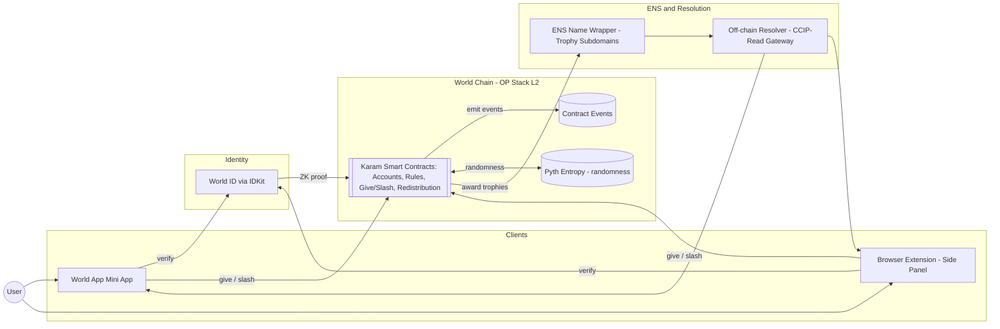
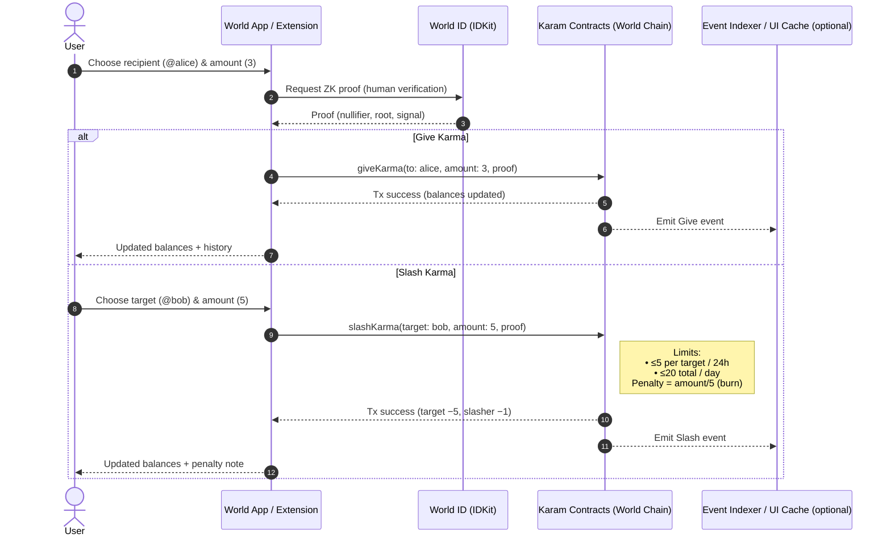
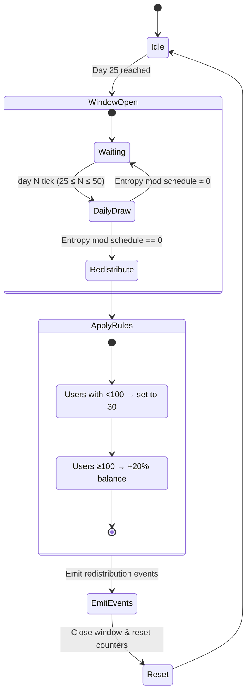

# Karam — Ungameable Reputation System

> **Human-gated, on-chain reputation.** Give and slash *Karma* with built-in limits, sybil-resistance via **World ID**, randomized redistributions via **Pyth Entropy**, and **ENS** trophies for top contributors. No likes. No bots. Just people.

---

## Table of Contents

* [What is Karam?](#what-is-karam)
* [Why Karam?](#why-karam)
* [Core Rules](#core-rules)
* [System Architecture](#system-architecture)
* [Screens & User Flows](#screens--user-flows)
* [Smart Contracts](#smart-contracts)
* [Identity (World ID)](#identity-world-id)
* [Randomness (Pyth Entropy)](#randomness-pyth-entropy)
* [Names & Recognition (ENS)](#names--recognition-ens)
* [Repo Structure](#repo-structure)
* [Local Development](#local-development)
* [Configuration](#configuration)
* [Testing](#testing)
* [Security & Anti-Abuse](#security--anti-abuse)
* [Roadmap](#roadmap)
* [FAQ](#faq)
* [Contributing](#contributing)
* [License](#license)

---

## What is Karam?

**Karam** is a social-good + blockchain project that turns everyday acts of kindness and accountability into a transparent score called **Karma**. It’s **peered and permissioned by humans**—not engagement algorithms.

* **One human = one account** using **World ID** proof-of-personhood.
* **Give** Karma to reward good actions.
* **Slash** Karma to discourage harmful behavior (with a cost to the slasher).
* **Random redistributions** keep the system fair and prevent permanent exclusion.
* **ENS** trophies (e.g., `god.karma.eth`, `angel.karma.eth`, `saint.karma.eth`) recognize top leaders.

> Karam runs on **World Chain (OP Stack L2)** with ~2s blocks (Chain ID **480**). Events are on-chain and auditable.

---

## Why Karam?

* **Social signals are noisy** (bots, bought followers, brigades).
* **Black-box feeds** reward outrage, not character.
* **Karam** offers a **verifiable, human-gated** reputation layer with **clear rules**, **hard rate limits**, and **costs on slashing**—all backed by **proof-of-personhood**.

---

## Core Rules

**Joining & Identity**

* Verify with **World ID** (IDKit).
* Start with **500 Karma**.
* Link socials (Twitter/X, GitHub, etc.) for **+10 Karma each**.

**Giving (positive actions)**

* You **spend from your own balance** (zero-sum transfer).
* Limits:

  * **≤ 5** to any single person per day
  * **≤ 30** total given per day

**Slashing (accountability)**

* You may **subtract** someone’s Karma.
* **Slasher penalty:** you **lose 1/5th** of what you slash (burned).

  * e.g., slash **10 → you lose 2**.
* Limits:

  * **≤ 5** slash points per target per 24h
  * **≤ 20** total slashed per day

**Random Redistribution (fairness over time)**

* On a random day between **25–50**, redistribution triggers using **Pyth Entropy** (VRF-class randomness).
* Users **< 100** → **set to 30** (floor/boost).
* Users **≥ 100** → **+20%** of current Karma.

---

## System Architecture

### High-Level Architecture



### Give & Slash Sequence



### Epoch Redistribution



---

## Screens & User Flows

**World App (Mini App)**

* Verify World ID → auto-create Karam account
* Views: **Balance**, **History** (last 5), **Leaderboard**
* Actions: **Give**, **Slash** (guarded by daily caps)
* Optional: ENS trophy display

**Browser Extension (Side Panel)**

* Side panel pages: **Profile**, **Today**, **All-Time**, **History**, **Admin**, **Directory**
* On `x.com/<handle>`: surface mapped Karam profile (if linked); quick give/slash

---

## Smart Contracts

**Design**

* **Non-transferable point ledger** (soulbound-like): balances live in Karam, not a tradable token.
* **Rules module**: centralizes caps, penalties, and redistribution parameters.
* **Epoch state**: tracks window (day 25–50), last redistribution, entropy draws.

**Key Events**

* `Give(address indexed from, address indexed to, uint256 amount)`
* `Slash(address indexed from, address indexed target, uint256 amount, uint256 penalty)`
* `Redistributed(uint256 when, uint256 usersBelowFloor, uint256 usersAboveFloor)`

**Addresses (World Chain)**

* Chain ID: **480**
* KaramRegistry: `TBD`
* KaramRules: `TBD`
* KaramRedistributor: `TBD`
  *(Populate after deployment.)*

---

## Identity (World ID)

* Use **IDKit** to request proofs in the client (Mini App / Extension).
* Submit `{ nullifier_hash, merkle_root, proof, signal }` alongside `give`/`slash`.
* Contracts verify via official World ID libraries (or server-side middleware if desired).

**Client Pseudocode**

```ts
const proof = await IDKit.getProof({ signal: toAddress });
await karamContract.giveKarma(toAddress, amount, proof);
```

---

## Randomness (Pyth Entropy)

* **Pyth Entropy** supplies VRF-class randomness for the **day 25–50** redistribution draw.
* The **modulus shrinks daily** (25→1) to avoid predictability and coordination.

**Pseudocode**

```solidity
uint256 daysSinceEpoch25 = /* 0..25 */;
uint256 mod = 25 - daysSinceEpoch25; // down to 1
bytes32 rnd = pythEntropy.getRandom(seedForEpoch);
if (uint256(rnd) % mod == 0) {
    _runRedistribution();
}
```

---

## Names & Recognition (ENS)

* **Trophy subdomains** (e.g., `god.karma.eth`, `angel.karma.eth`, `saint.karma.eth`) awarded to leaderboard winners.
* Use **ENS Name Wrapper** to set **fuses** and predictable permissions.
* **CCIP-Read (EIP-3668)** resolver can mirror Karam state so mainnet lookups reflect World Chain balances.

---

## Repo Structure

```
karam/
├─ apps/
│  ├─ miniapp/            # World App Mini App (webview)
│  └─ extension/          # Browser extension (Side Panel + X overlays)
├─ contracts/             # Solidity source (Foundry/Hardhat)
├─ packages/
│  ├─ sdk/                # TS client, hooks, schema
│  └─ resolver/           # CCIP-Read gateway + ENS offchain resolver
├─ ops/                   # Deploy scripts, addresses, env templates
├─ docs/                  # Diagrams, specs
└─ README.md
```

---

## Local Development

### Prerequisites

* **Node.js** ≥ 20, **pnpm** ≥ 9
* **Foundry** (or Hardhat)
* An RPC for **World Chain** (or a compatible local L2 for dev)
* API keys where applicable (World ID dev config, etc.)

### Install

```bash
pnpm i
pnpm -w build
```

### Environment

Copy templates and fill values:

```bash
cp apps/miniapp/.env.example apps/miniapp/.env
cp apps/extension/.env.example apps/extension/.env
cp contracts/.env.example contracts/.env
cp packages/resolver/.env.example packages/resolver/.env
```

**Common vars**

```
# chain
WORLDCHAIN_RPC_URL=...
WORLDCHAIN_CHAIN_ID=480
DEPLOYER_PRIVATE_KEY=0x...

# world id (dev)
WORLD_ID_APP_ID=...
WORLD_ID_ACTION=karam-verify

# resolver / gateway
CCIP_SIGNER_PRIVATE_KEY=0x...
ENS_PARENT_NAME=karma.eth
```

### Run (clients)

```bash
# Mini App
pnpm --filter miniapp dev

# Extension (Vite)
pnpm --filter extension dev
```

### Compile/Deploy (contracts)

```bash
pnpm --filter contracts build
pnpm --filter contracts test
pnpm --filter contracts deploy:worldchain
```

---

## Testing

* **Unit tests (Solidity):** limits, penalties, redistribution math.
* **Property tests:** invariant that *total supply* adjusts only via slasher burn + redistribution.
* **E2E (Playwright/Cypress):** give/slash flows with mocked World ID and entropy.

```bash
pnpm --filter contracts test
pnpm --filter miniapp test
pnpm --filter extension test
```

---

## Security & Anti-Abuse

* **Sybil resistance:** World ID proof required for actions.
* **Rate limits:** Per-target and per-day caps on give/slash (on-chain enforced).
* **Slasher penalty:** Built-in cost (burn) to deter harassment.
* **Random epochs:** Redistribution on unpredictable days (25–50).
* **Transparency:** All actions emit events for auditability.

> ⚠️ **Responsible Use:** Karma is social data. Avoid doxxing, harassment, or off-platform witch-hunts. Use Karam to **reward contribution** and **discourage harm**—never to target individuals.

---

## Roadmap

* **Badges/NFTs** for tiers (e.g., saint/angel/god) with clear fuse behavior.
* **Tiered rule sets** (higher Karma → adjusted caps).
* **Indexer & public API** for explorers and apps.
* **Progressive decentralization** of governance and parameters.
* **Expanded ENS integrations** (reverse resolution, search/autocomplete).

---

## FAQ

**Is Karma a token? Can I transfer it?**
No. Karma is a **non-transferable** point ledger inside Karam. You can only affect balances via **give** or **slash** within rules.

**Why do I lose points when I slash?**
To **internalize the cost** of negative judgments and deter abuse. Penalty = **amount / 5** (burn).

**What stops brigading?**
**Per-target caps**, **daily totals**, **penalties**, and **World ID** proofs. Redistribution also reduces the impact of coordinated griefing over time.

**Do you use any price feeds or handle payments?**
No. Karam **does not** include price feeds or payment flows.

---

## Contributing

Contributions welcome!

* Open an issue with proposed changes.
* For PRs: add tests + docs; keep functions small and audited.

**Dev scripts**

```bash
pnpm lint
pnpm test
pnpm -w build
```

---

## License

**MIT** — see [`LICENSE`](./LICENSE).

---

## Appendix: Rule Math (Reference)

**Give**

```
require(dailyGiven[msg.sender] + amount ≤ 30)
require(givenToToday[msg.sender][to] + amount ≤ 5)
balances[msg.sender] -= amount
balances[to]         += amount
emit Give(msg.sender, to, amount)
```

**Slash**

```
require(dailySlashed[msg.sender] + amount ≤ 20)
require(slashedToToday[msg.sender][target] + amount ≤ 5)
uint256 penalty = amount / 5
balances[target]    = balances[target] - amount
balances[msg.sender]= balances[msg.sender] - penalty
_burn(penalty)
emit Slash(msg.sender, target, amount, penalty)
```

**Redistribution (day 25–50)**

```
mod = 25 - daysSince25        // 25→1
if (rand % mod == 0) {
  for each user:
    if (balance < 100) balance = 30
    else balance += balance / 5  // +20%
  emit Redistributed(...)
  resetWindow()
}
```

---

### Diagrams (for GitHub)

Copy-paste into the README as-is:

<details>
<summary>High-Level Architecture</summary>

```mermaid
flowchart LR
  user((User))

  subgraph Clients
    WorldApp[World App Mini App]
    Ext[Browser Extension (Side Panel)]
  end

  subgraph Identity
    WorldID[World ID (IDKit / Proof-of-Personhood)]
  end

  subgraph OnChain[World Chain (OP Stack L2)]
    Contracts[[Karam Smart Contracts<br/>• Accounts & Balances<br/>• Rules & Limits<br/>• Give / Slash<br/>• Redistribution]]
    PythEntropy[(Pyth Entropy<br/>VRF-class randomness)]
    Logs[(Contract Events)]
  end

  subgraph Names[ENS / Resolution]
    NameWrapper[ENS Name Wrapper<br/>(trophy subdomains)]
    CCIP[Off-chain Resolver (CCIP-Read)<br/>+ Gateway mirroring Karam state]
  end

  user --> WorldApp
  user --> Ext

  WorldApp -->|verify| WorldID
  Ext -->|verify| WorldID
  WorldID -->|ZK proof| Contracts

  WorldApp -->|tx: give/slash| Contracts
  Ext -->|tx: give/slash| Contracts
  Contracts -->|emit events| Logs

  Contracts <-->|randomness| PythEntropy

  Contracts -->|leaderboard winners| NameWrapper
  CCIP --> WorldApp
  CCIP --> Ext
  NameWrapper --> CCIP
```

</details>

<details>
<summary>Give & Slash Sequence</summary>


</details>

<details>
<summary>Epoch Redistribution</summary>


</details>

---

*Built with ❤️ for a kinder internet.*